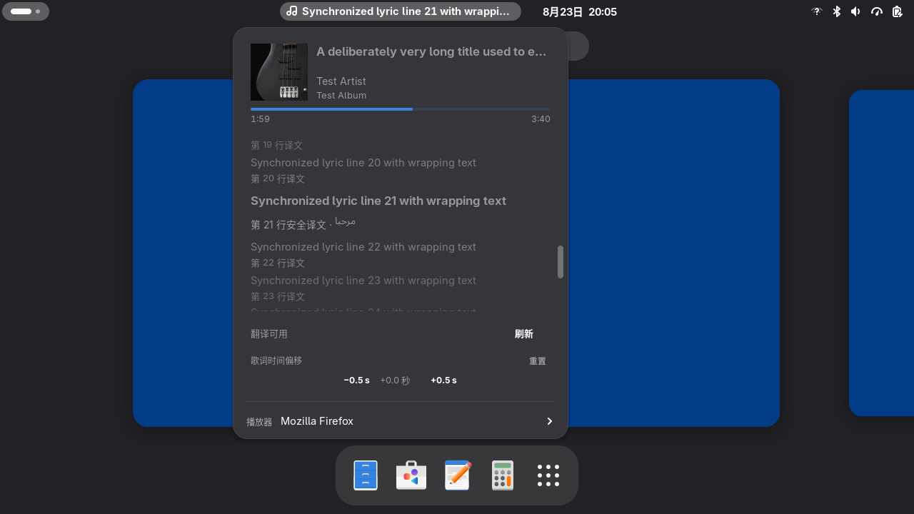
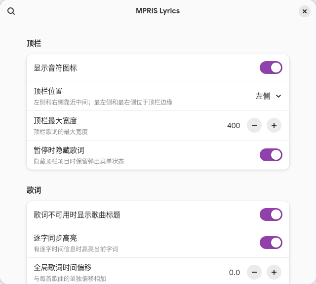

# MPRIS Lyrics

在 GNOME 顶栏显示 MPRIS 播放器的同步歌词，并可在原生 Shell 弹出菜单中查看封面、
播放进度、逐行/逐字歌词和可选的行级翻译。





## 功能

- 通过 MPRIS 自动发现播放器；不依赖 `playerctl`，不轮询播放器状态。
- 从 LRCLIB 获取逐行、逐字、纯文本或纯音乐信息。
- 顶栏歌词、原生 popup、封面、播放进度、播放器选择和每首歌曲时间偏移。
- 原文、双语或仅译文显示；原歌词和 timing 始终是唯一事实来源。
- 逐字高亮只作用于原文，不为译文伪造 karaoke timing。
- 有界的歌词、封面、翻译和歌曲偏移缓存。
- GTK4/Libadwaita Preferences；英文和简体中文界面。

更多发布截图见 [`docs/screenshots/`](docs/screenshots/)。

## 兼容性

- Fedora Linux
- GNOME Shell 50（当前实际测试为 50.4）
- Wayland
- GJS ES Modules

`metadata.json` 只声明 GNOME Shell 50。GNOME 49 和 51 未验证，也未声明支持。播放器只需
正确实现 MPRIS 2；不会为 Spotify 或浏览器使用专用 API。详细手工验证状态和未来升级
风险见 [`docs/compatibility.md`](docs/compatibility.md)。

## 安装

### Release 用户

从 GitHub Release 下载 `mpris-lyrics@eureka.shell-extension.zip`，然后运行：

```sh
gnome-extensions install --force mpris-lyrics@eureka.shell-extension.zip
gnome-extensions enable mpris-lyrics@eureka
```

首次安装或更新 JavaScript 后请注销并重新登录。GNOME Shell 50 会在当前 Shell 进程中
缓存已导入的 ESM，单纯 disable / enable 不能证明新模块已经 fresh-import。

项目提交到 extensions.gnome.org 前不会在这里放置不存在的商店链接。

### 开发者

```sh
git clone https://github.com/eurekaevan/mpris-lyrics.git
cd mpris-lyrics
make check
make install
gnome-extensions enable mpris-lyrics@eureka
```

## Preferences

```sh
gnome-extensions prefs mpris-lyrics@eureka
```

可设置顶栏位置和宽度、暂停时可见性、逐字高亮、全局歌词时间偏移、翻译显示方式、
目标语言、播放器偏好，以及清理扩展自己的缓存。每首歌曲的单独偏移在 popup 中调整。

设置通过 GSettings 即时生效。`preferred-player` 保存稳定的 DesktopEntry/Identity，
不保存临时 MPRIS bus name。

## 翻译设置

翻译默认关闭。启用前，在 Preferences 中选择 OpenAI provider 并通过“翻译 API 密钥”
配置凭据。密钥只写入 GNOME Secret Service/libsecret，不进入 GSettings、JSON cache、
请求日志或 Git。

翻译使用缓存优先的行级文档：每行以稳定 `lineId` 对齐，并校验原歌词 hash。请求失败时
原歌词仍可用。自动翻译也必须先显式启用翻译功能。

## 工作方式

```text
MPRIS signals
  → normalized playback state
  → LRCLIB lookup and LyricsDocument
  → monotonic playback synchronization
  → panel and popup updates
```

播放器发现使用 `NameOwnerChanged`，状态更新使用 `PropertiesChanged`，跳转使用 `Seeked`。
歌词只为下一行或下一字边界安排一次性 timer；popup 打开时每 500 ms 从现有 monotonic
clock 刷新纯 UI 进度，关闭后立即移除，不额外读取 D-Bus Position。

运行时资源由创建它们的 owner 释放：disable/destroy 会取消 `Gio.Cancellable`、移除 GLib
和 Meta later source、断开 signal、停止 transition、销毁 actor 并释放引用。异步结果再
通过 request generation 或当前 owner identity 防止旧请求覆盖新歌曲。

主要模块：

- `extension.js`：扩展生命周期和 MPRIS → lyrics → UI 协调。
- `mpris.js`：D-Bus discovery、signal-driven playback clock 和 player policy。
- `lyrics.js`、`lyrics-*`：LRCLIB、解析、匹配、统一文档与同步。
- `translation-*`、`credentials.js`：独立翻译文档、provider、cache 和 Secret Service。
- `indicator.js`、`artwork-*`、`ui-utils.js`：Shell UI、封面和纯 UI 计算。
- `storage.js`：有界缓存和歌曲偏移持久化。
- `prefs.js`、`schemas/`：Preferences 和 GSettings。

## 开发与测试

确定性发布检查：

```sh
make clean
make check
make integration
```

`make check` 验证 schema、gettext、纯逻辑测试、打包、zip 内容和所有相对 runtime imports；
`make integration` 使用隔离 D-Bus 和本地 HTTP server 验证 MPRIS 事件、网络错误/429/大小
限制/取消、cache 和 storage，不访问 Spotify、LRCLIB 或真实翻译 API。

打包：

```sh
make pack
unzip -l mpris-lyrics@eureka.shell-extension.zip
```

可选的 Secret Service 测试会写入一个独立测试 secret，并在结束前删除：

```sh
make integration-secret
```

真实播放器或网络测试位于 `tests/integration-live-*.js`。部分测试会控制播放状态或切歌，
运行前请阅读文件和命令说明。发布验证详情见 [`docs/EGO-CHECKLIST.md`](docs/EGO-CHECKLIST.md)。

## 已知限制

- 顶栏五种位置需要 GNOME Shell 50 的 `Main.panel._leftBox/_centerBox/_rightBox`；Shell 50
  没有提供等价的公开运行时移动 API。访问已集中在一个兼容函数中。
- Firefox Spotify Web 可能复用 TrackId，因此歌曲 identity 同时包含 bus、TrackId、
  title、artist 和 duration。
- LRCLIB 或翻译服务不可用时会优雅 fallback，但无法提供未缓存的新内容。
- 新 JavaScript 在当前 GNOME Shell 50 会话中需要注销/登录后才能得到 fresh ESM 证明。

## 隐私与网络访问

扩展读取当前 MPRIS 播放器公开的：

- title、artist、album；
- playback status、position、duration；
- `mpris:artUrl`。

可能产生的外部访问：

- **LRCLIB**：发送当前歌曲的 title、artist、album 和 duration，以查找歌词。
- **已配置的翻译 provider**：仅在翻译已启用并实际请求时发送 title、artist、歌词文本和
  target language。
- **Artwork**：读取播放器提供的本地 `file://`，或仅在播放器给出远程 art URL 时访问
  HTTP(S) 地址。

扩展不读取 Spotify account token，不使用 Spotify OAuth，不读取浏览器 cookie，不扫描
浏览器或 Spotify 文件系统，不上传播放历史。AI 翻译默认关闭。网络响应有大小上限，
请求可取消；429 最多重试一次并尊重 `Retry-After`。Authorization header 和 API key
不会写入 journal。

持久数据只写入扩展自己的 namespace：

- `$XDG_CACHE_HOME/mpris-lyrics/`：歌词、封面和翻译 cache；
- `$XDG_CONFIG_HOME/mpris-lyrics/offsets.json`：每首歌曲的歌词偏移；
- GNOME Secret Service：翻译 credential。

清理按钮只删除对应的扩展 cache，不删除父目录或其他应用数据；disable 不删除持久状态。

## License

MPRIS Lyrics 采用 [GPL-2.0-or-later](LICENSE)。随包提供的 readable ESM
`js-yaml` 4.1.0 采用 MIT License；来源、固定 SHA-256、是否修改和复现方式见
[`README.js-yaml.md`](README.js-yaml.md) 与 [`LICENSE.js-yaml`](LICENSE.js-yaml)。
